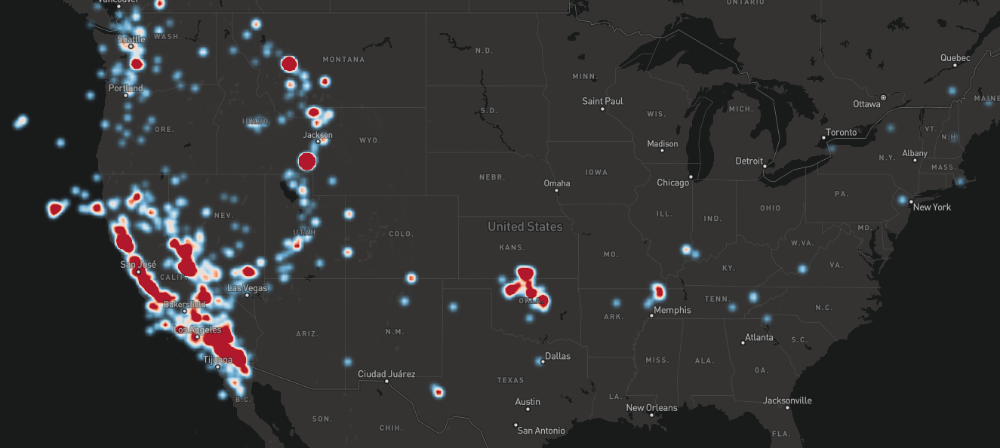
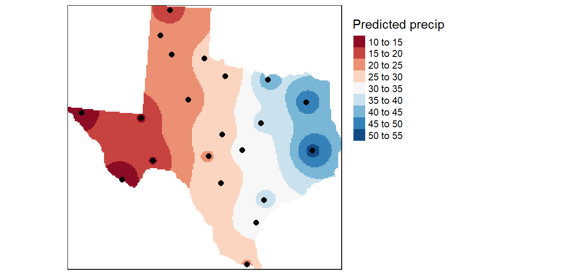

# InterpolateHeatmapLayer

InterpolateHeatmapLayer is a JavaScript library for rendering temperature maps (or interpolate heatmaps) with [Mapbox GJ JS](https://docs.mapbox.com/mapbox-gl-js/guides/). This library was inspired by the [temperature-map-gl](https://github.com/ham-systems/temperature-map-gl) library and depends on [Earcut](https://github.com/mapbox/earcut).

Currently, Mapbox provides a heatmap layer that represent the **density** of points in an area, like on this picture:



This library aims at providing a heatmap that can define a color to any location by making an **average** of the values of the surroundings points, like on this picture:



Except a JavaScript pre-processing step, all computation is made with WebGL shaders.

## Examples

A live demo showing the global temperature is available [here](https://rylern.github.io/TemperatureMap/), described [here](https://github.com/Rylern/TemperatureMap).

## Install

Note that this layer only works if the [Mercator](https://docs.mapbox.com/mapbox-gl-js/guides/projections/#what-projections-are-available) projection is used on the Mapbox map.

* Browser:

  * Copy the [interpolateHeatmapLayer.js](https://github.com/Rylern/InterpolateHeatmapLayer/blob/main/dist/interpolateHeatmapLayer.js) file to your project.

  * Import the library before the script using it:

    ```html
    <body>
        <div id="map"></div>
        <script src="interpolateHeatmapLayer.js"></script>
        <script src="map.js"></script>
    </body>
    ```

  * Create the Mapbox map and add the layer created by `interpolateHeatmapLayer.create()`:

  ```javascript
  // map.js
  
  const map = (window.map = new mapboxgl.Map({
      container: 'map',
      style: 'mapbox://styles/mapbox/light-v10'
  }));
      
  map.on('load', () => {
      const layer = interpolateHeatmapLayer.create({
          // parameters here
      });
      map.addLayer(layer);
  });
  ```


* NPM:

  ```bash
  npm install interpolateheatmaplayer
  ```

  ```javascript
  const interpolateHeatmapLayer = require('interpolateheatmaplayer');
  // or: import { create as InterpolateHeatmapLayer } from 'interpolateheatmaplayer';
  
  const map = (window.map = new mapboxgl.Map({
      container: 'map',
      style: 'mapbox://styles/mapbox/light-v10'
  }));
      
  map.on('load', () => {
      const layer = interpolateHeatmapLayer.create({
          // parameters here
      });
      // or: const layer = InterpolateHeatmapLayer({});

      map.addLayer(layer);
  });
  ```

## Usage

The `interpolateHeatmapLayer.create()` function has one object parameter containing the following properties:

* `points`: An list of points, each point being an object containing a latitude `lat`, a longitude `lon`, and a value `val`. Example:

  ```javascript
  points = [{
    lat: 62.470663,
    lon: 6.176846,
    val: 16
  },
  {
    lat: 48.094903,
    lon: -1.371596,
    val: 20
  }];
  ```

  Since Mapbox uses the Web Mercator projection that projects the poles at infinity, remember to define the latitude within -85° and 85°. Default value: `[]`.

* `layerId`: string defining the unique [Mapbox layer](https://docs.mapbox.com/mapbox-gl-js/style-spec/layers/#id) name. Default value: `''`.

* `opacity`: number between 0 and 1 describing the transparency of the layer. Default value: `0.5`.

* `minValue`: number defining the value corresponding to the blue color. When it's not defined, the lowest value of `points` is represented by the blue color. If some value of `points` is lower than `minValue`, `minValue` takes this value. Default value: `Infinity`.

* `maxValue` same, but for the red color. Default value: `-Infinity`.

* `p`: number affecting the computation of the color. A high value makes the color uniform around each point. Take a look at the form of the IDW in the technical explanation part if you want to know more. Default value: `3`.

* `pointRadius`: number defining a radius (in meters). The color will only appear within circles of radius `pointRadius` centered at the points defined in `points`. If `pointsRadius <= 0`, this parameter is not taken into account. Default value: `0`.

* `fasterPointRadius`: boolean indicating if a faster algorithm should be used when defining a `pointRadius > 0`. Due to precision issues, this parameter creates bad visualizations if `pointRadius < 500`. Default value: `false`.

* `roi`: list of coordinates with the same format as `points` (without the `val` attribute). It defines the region of interest, meaning the layer will only be displayed inside that area. If the list is empty, the entire map is the region of interest. If `pointRadius > 0` and a ROI is defined, then the heatmap will only appear on locations that are within the circles AND within the ROI. Default value: `[]`.

* `averageThreshold`: number defining a threshold. For each point of the map, if the distance between the point's value and the average value of all points is below this threshold, the associated color will be transparent. The values and the average are scaled between 0 and 1 when computing their distance, so `averageThreshold` is a value between 0 and 1. For example, if you have `points` with values [0, 5, 10], and you create the layer with these parameters:

  ```javascript
  const layer = interpolateHeatmapLayer.create({
      points: points
      averageThreshold: 0.1
  });
  ```

  Then all points with values between 4 and 6 will be transparent.

* `framebufferFactor`: number between 0 and 1. In short, if the framebuffer factor is around 0, the computation of the Inverse Distance Weighting algorithm will be faster but with a lower resolution. Take a look at the technical explanation part if you want to know exactly what this parameter is. Default value: `0.3`.

* `valueToColor`: [GLSL](https://www.khronos.org/opengl/wiki/OpenGL_Shading_Language) function (passed as a string) that maps a value to the layer color. By default, a low value is colored blue, a medium green and a high red. This parameter allows you to change this behavior. The function must be named `valueToColor` with a `float` parameter (which will take values between 0 and 1), and must return a ` vec3` (with each component between 0 and 1). Default value:

  ```glsl
  vec3 valueToColor(float value) {
    return vec3(max((value-0.5)*2.0, 0.0), 1.0 - 2.0*abs(value - 0.5), max((0.5-value)*2.0, 0.0));
  }
  ```

* `valueToColor4`: Same as `valueToColor`, but with alpha channel support. The function name and signature must be defined as: `vec4 valueToColor4(float value, float defaultOpacity)`. Default value:

  ```glsl
  vec4 valueToColor4(float value, float defaultOpacity) {
      return vec4(valueToColor(value), defaultOpacity);
  }
  ```

* `layerBlendingFactor`: a GLEnum that describes a coefficient to apply to the heatmap layer when blending with the map. Depending on where the heatmap layer is created, it is likely that it will appear on top of the map. In that case, pixels of the heatmap layer are blended with pixels of the map. The resulting color of a pixel is given by:

  ```
  color = (layerColor * layerBlendingFactor) + (mapColor * mapBlendingFactor)
  ```

  where `layerBlendingFactor` and `mapBlendingFactor` are parameters specifiable here.

  A list of possible values of these parameters can be found [here](https://developer.mozilla.org/en-US/docs/Web/API/WebGLRenderingContext/blendFunc#constants):
  * You have to replace `gl` by `WebGLRenderingContext`, for example `WebGLRenderingContext.ZERO`.
  * The source color refers to the heatmap color, and the destination color refers to the map color.
  
  Default value: `WebGLRenderingContext.SRC_ALPHA`.

* `mapBlendingFactor`: same as `layerBlendingFactor`, but for the map. Default value: `WebGLRenderingContext.ONE_MINUS_SRC_ALPHA`.

The `layer` returned by the `interpolateHeatmapLayer.create()` function has also one function: `layer.updatePoints(points)`, in which `points` is an array of points as described above (objects with `lat`, `lon`, and `val` attributes). This function allows you to change the points without creating a new layer. Usage example:

```javascript
const layer = interpolateHeatmapLayer.create({
  points: somePoints
});
// some code
layer.updatePoints(newPoints);
```

## Technical explanation

The color is computed using the [Inverse Distance Weighting](https://en.wikipedia.org/wiki/Inverse_distance_weighting) (IDW) algorithm:

Let:


be *N* known data points. We want to find a continuous and once differentiable function:


such as:


The basic form of the IDW is:


where


In WebGL, the computation is done in three steps:

* First, we determine where to display the heatmap. This can change depending on the `pointRadius` or `roi` parameters for example. For that, we create a texture where pixel values indicate if the heatmap should be displayed or not. Think of it as a **mask** in Computer Graphics.

* Then, we compute the values given by the **IDW** equation. For that, we render *N* textures, one for each known data point *ui*. Each pixel of each texture contains *wi\*ui* in its red channel and *wi* in its green channel. These textures are added together to create a single resulting texture containing the sum of the *N* textures. We can get u(x) for each pixel by dividing the red channel by the green channel, since they contain respectively *sum(wi\*ui)* and *sum(ui)*.

* Finally, the first (mask) and last (IDW) textures are combined to create the heatmap layer. For each pixel, if the mask pixel indicates that the heatmap should appear here, the IDW pixel is used to compute u(x), and this value is converted to a color using the `valueToColor` parameter.

As you can see, N+3 textures are created, with N+1 textures for the IDW step. This step is therefore the most expensive one. To make it a bit faster, we can reduce the sizes of those N+1 textures (a smaller texture means fewer pixels to compute). This is what the `framebufferFactor` is for. The width/height of the IDW textures are the width/height of the drawing texture divided by the `framebufferFactor`. For example, if the Mapbox map has a size of 800x600 pixels and the `framebufferFactor` is 0.5, then the IDW textures will have a size of 400x300 pixels. This will alter the visual aspect of the heatmap but will make the computer faster, so there is a compromise to find.
